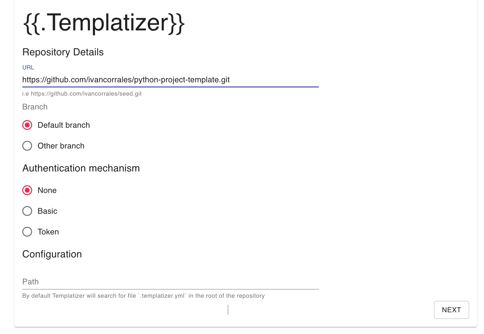

[](CHANGELOG.md)
[](https://github.com/wesovilabs/templatizer/releases)
[](https://pkg.go.dev/github.com/wesovilabs/templatizer)
[](go.mod)
[](LICENSE)
[](https://github.com/wesovilabs/templatizer/actions?query=workflow%3Abuild+branch%3Amain)
[](https://goreportcard.com/report/github.com/wesovilabs/templatizer)
[](https://codecov.io/gh/wesovilabs/templatizer)
[](https://github.com/wesovilabs/templatizer/actions/workflows/codeql-analysis.yml)
---
# {{.Templatizer}}

The intention of **Templatizer** is to provide a handy and powerful mechanism to create a custom project boilerplate from existing template repositories.

Git repositories engines such as Github or Gitlab claim that they support template repositories. However, they only provide us a way to tag repositories as templates; but we will need to replace values" after copying/cloning the templates.  Sincerely,  this is far to be a template mechanism from my point of view.

## Getting started

Templatizer takes advantage of existing template engines. So far, Templatizer supports Go Template but It's on the roadmap to provide other flavors such as Jinja.

Templatizer is meant to be executed as an executable file from your local machine. Thus,  the communication with the repositories will be established on your own machine and the credentials won't be sent over the Internet.

Templatizer is composed of two parts: a server and a web application but distributed as a single application. The server listens to the requests from the web application on port 16917 (This should be parameterized in upcoming releases). The port used by the web application can be any available port on your local machine. Templatizer will find an available port and open the web app on your browser. The port used by the web application can't be specified so far but It will be soon ([issue](https://github.com/wesovilabs/templatizer/issues/5)).

## Installation

As It was mentioned in the above section, Templatizer is distributed as a single application. Let's see the different available options to install Templatizer on your local machine.
### Homebrew

```bash
brew tap wesovilabs/tools
brew install templatizer
```
### Snap

```bash
snap install templatizer
```
### Download executable files

Visit the [releases](https://github.com/wesovilabs/templatizer/releases) to find the compilation that works best  for you.

### Build Templatizer from the code

The executables of Templates can be found in the folder `dist`, after running the following commands.

```bash
git clone git@github.com:wesovilabs/templatizer.git
cd templatizer
make buildFrontend build
```
### Run from the code

Templatizer can launched from the code as following:

```bash
git clone git@github.com:wesovilabs/templatizer.git
cd templatizer
make buildFrontend run
```

## Templatizer in action

1. The web browser will be automatically opened when we execute `templatizer`. As was mentioned earlier, the port,  in which we can access the web application, can be whichever available port on the machine.

2. We must enter the values of the template repository. We can configure private repositories. Click on button `Next` when data are filled.



* SSH connection will be supported in [the next release](https://github.com/wesovilabs/templatizer/issues/3).

1. In this section, we just need to enter the values for the variables. Once we'v e fileld the data we can click on button `Process template`. A tarball named `templatizer.tar.gz` will be downloaded. Let's uncompress that tarball to get our own project boilerplate.


## Define your own templates

The template is the keystone in Templatizer. A template is a Git repository hosted on any web repositories. The templates will contain values to be dynamically replaced (variables). The variables can be used in the content of the files but also in the name of folders and files.

To define the variables in the templates we will use the specified format by Go Template. Variables are defined as {{.variable}}. See the following example taken from a Go file.

```go
package main

import (
	"embed"
	"io/fs"
	"net/http"
	log "{{.logger}}"
)

//go:embed {{.sitePath}}
var content embed.FS

func clientHandler() http.Handler {
	fsys := fs.FS(content)
	contentStatic, _ := fs.Sub(fsys, "{{.sitePath}}")
	return http.FileServer(http.FS(contentStatic))
}

func main() {
	mux := http.NewServeMux()
	mux.Handle("/", clientHandler())
	if err := http.ListenAndServe(":{{.serverPort}}", mux); err != nil {
		log.Fatal(err)
	}
}
```

The below screenshot shows an example of how we can use variables in the name of the folders and the files.


To create a template that can be understood by Templatozer we need to add a  YAML file in our repository. By convection, this file must be named `.templatizer.yml` and hosted in the root of the repository, but we could do it on our way.

```yml
#version: v1
#mode: goTemplate
variables:
  - name: logger
    default: github.com/sirupsen/logrus
  - name: serverPort
    default: 3000
  - name: sitePath
    description: Path to the static embedded foler
  - name: DBPassword
	description: DB Password for integration tests
	secret: true
  - name: organization
    description: Name of the GH organization
```

**File Specification**

The attributes `version` and `mode` can be omited since they are ignored in the latest release of Templatizer.

Apart from that, we need to define a block `variables` with the list of variables used in our template. To define  each variable we can use the following attributes:
- `name`: It's mandatory, the name of the variables.
- `description`: It's useful for people that make use of this template.
- `default`: It is an optional attribute we can define a default value that will be loaded by Templatizer when a user wants to make use of this template.
- `secret`: If we set `true` the field will be rendered as a `password` input field in the Templatizer web application.

You can find some examples of templates :

- [https://github.com/ivancorrales/templatizer-demo](https://github.com/ivancorrales/templatizer-demo)
- [https://github.com/ivancorrales/python-project-template](https://github.com/ivancorrales/python-project-template)
- [https://github.com/ivancorrales/seed](https://github.com/ivancorrales/seed)
## Contributing

Contributions are welcome, but before doing it I hardly recommend you to have a look at the [CONTRIBUTING.md](CONTRIBUTING.md) and the [CODE_OF_CONDUCT.md](CODE_OF_CONDUCT.md).

### Awesome Tempaltes

> I encourage you to share your Templatizer tempaltes with others.

Make a Pull Request including your template in file [AWESOME_TEMPLATES.md](AWESOME_TEMPLATES.md)
